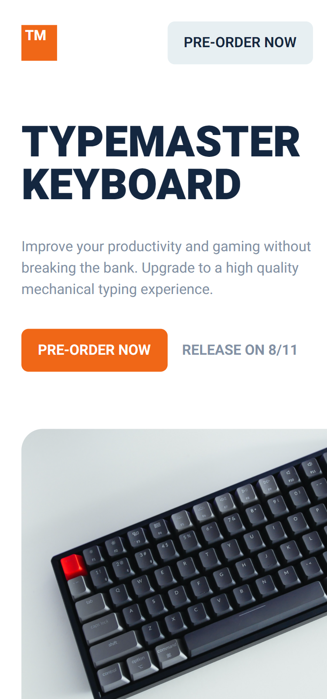
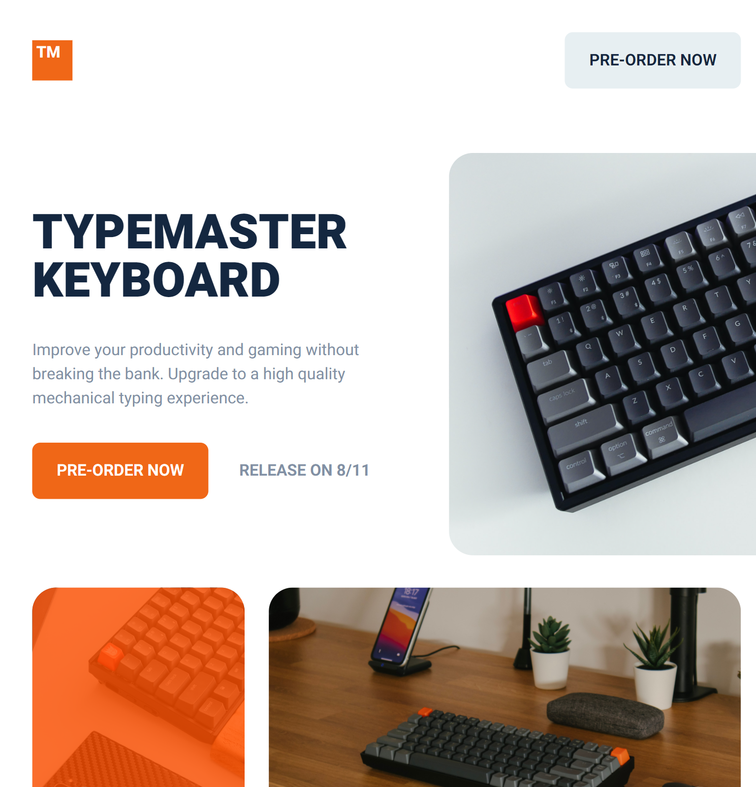

# Frontend Mentor - Typemaster pre-launch landing page solution

This is a solution to the [Typemaster pre-launch landing page challenge on Frontend Mentor](https://www.frontendmentor.io/challenges/typemaster-prelaunch-landing-page-J6-Yj5J-X).

## Screenshot




## Usage

Clone this repository and go to the folder

```bash
$ git clone https://github.com/pejamp/grid-landing-page.git
$ cd grid-landing-page
```

To run, follow the steps below:

```bash
# Install dependencies
$ npm install

# Run the project
$ npm run dev
```

## Author

<a href="https://github.com/pejamp">
 
 <br />
 <sub><b>Pedro Rodrigues</b></sub>
</a> 
<a href="https://github.com/pejamp"></a>
<br />

## Contact me!

[](https://www.linkedin.com/in/pedro-rodrigues-3a3647176/)
[](mailto:pedro.roguea@gmail.com)
